<h2>TensorFlow-FlexUNet-Image-Segmentation-MRI-Brain-Tumor-T2 (2025/07/16)</h2>

This is the first experiment of Image Segmentation for MRI-Brain-Tumor-T2 based on our TensorFlowFlexUNet (TensorFlow Flexible UNet Image Segmentation Model for Multiclass) and a 512x512 pixels 
<a href="https://drive.google.com/file/d/1Gf5Osuuy1X-FWL-zM4AmfusQY6TCZEih/view?usp=sharing">
Brain-PNG-MRI-T2-ImageMask-Dataset.zip</a>.
which was derived by us from  
<a href="https://data.mendeley.com/datasets/8bctsm8jz7/1">
Brain MRI Dataset of Multiple Sclerosis with Consensus Manual Lesion Segmentation and Patient Meta Information 
</a>
  
As demonstrated in <a href="https://github.com/sarah-antillia/TensorFlow-FlexUNet-Image-Segmentation-STARE-Retinal-Vessel">
TensorFlow-FlexUNet-Image-Segmentation-STARE-Retinal-Vessel</a> ,
 our Multiclass TensorFlowFlexUNet, which uses categorized masks, can also be applied to 
single-class image segmentation models. 
This is because it inherently treats the background as one category and your single-class mask data as 
a second category. In essence, your single-class segmentation model will operate with two categorized classes within our Multiclass UNet framework.
 
 
<b>Acutual Image Segmentation for 512x512 MRI-Brain-Tumor-T2 images</b> 
As shown below, the inferred masks look very similar to the ground truth masks. 
  
<table>
<tr>
<th>Input: image</th>
<th>Mask (ground_truth)</th>
<th>Prediction: inferred_mask</th>
</tr>
<tr>
<td>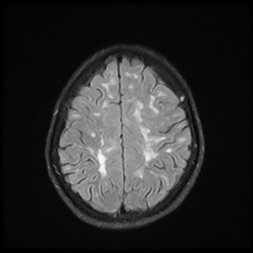</td>
<td>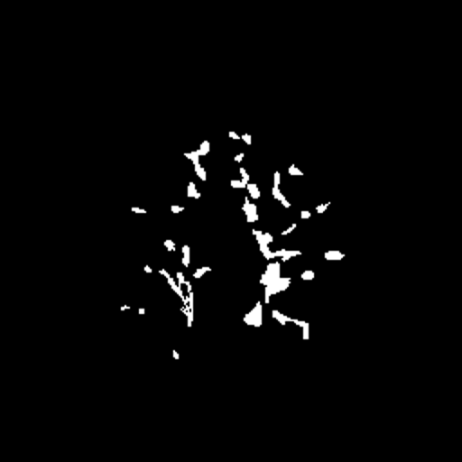</td>
<td>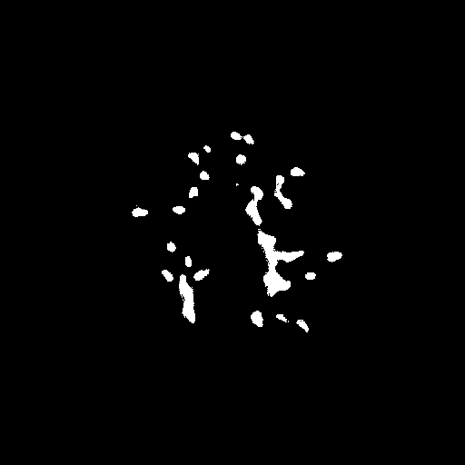</td>
</tr>
<tr>
<td>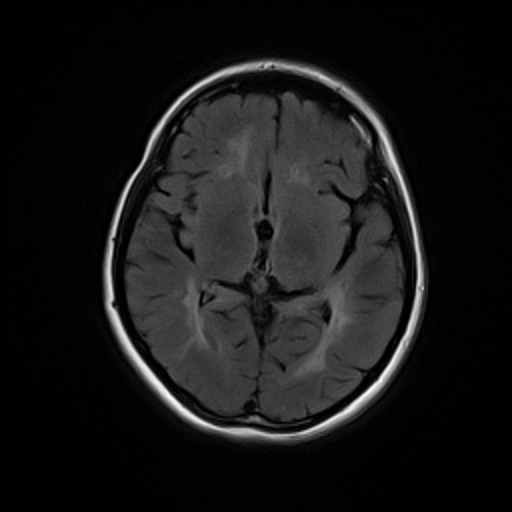</td>
<td></td>
<td></td>
</tr>
<tr>
<td>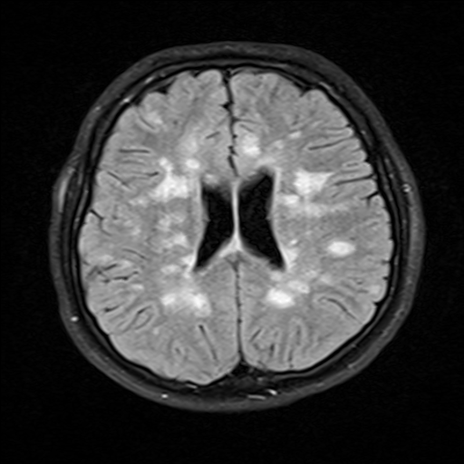</td>
<td>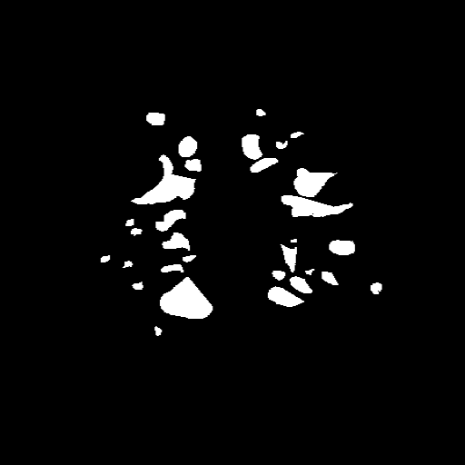</td>
<td>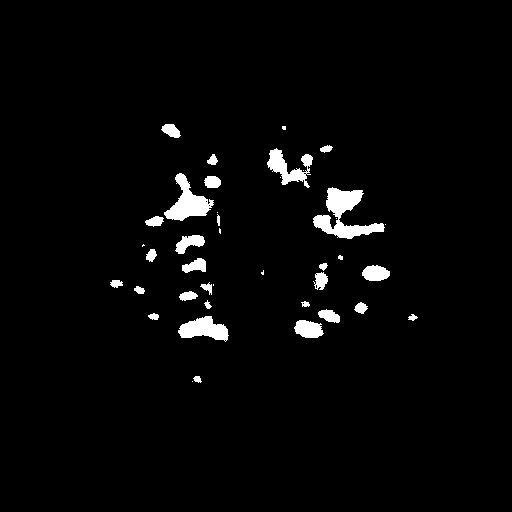</td>
</tr>
</table>

 
<h3>1. Dataset Citation</h3>
We used the following dataset to create our ImageMask dataset  
<a href="https://data.mendeley.com/datasets/8bctsm8jz7/1"><b>
Brain MRI Dataset of Multiple Sclerosis with Consensus Manual Lesion Segmentation and Patient Meta Information 
</b>
</a>
 
 
Published: 31 March 2022|Version 1|DOI:10.17632/c
 
 
<b>Contributor:</b>Ali M Muslim
 
 
<b>Description:</b> 
Magnetic resonance imaging (MRI) provides a significant key to diagnose and monitor the progression of Multiple Sclerosis (MS) disease. Manual MS-Lesion segmentation, Expanded Disability Status Scale (EDSS) and patient’s meta information can provide a gold standard for research in terms of automated MS-lesion quantification, automated EDSS prediction and identification of the correlation between MS-lesion and patient disability. In this dataset, we provide a novel multi-sequence MRI dataset of 60 MS patients with consensus manual lesion segmentation, EDSS, general patient information and clinical information. On this dataset, three radiologists and neurologist experts segmented and validated the manual MS-lesion segmentation for three MRI sequences T1-weighted, T2-weighted and fluid-attenuated inversion recovery (FLAIR). The dataset can be used to study the relationship between MS-lesion, EDSS and patient clinical information. Furthermore, it also can be used to development of automated MS-lesion segmentation, patient disability prediction using MRI and correlation analysis between patient disability and MRI brain abnormalities include MS lesion location, size, number and type. 
 
 
<b>Licence:</b> CC BY 4.0 
 
 

<h3>
<a id="2">
2 MRI-Brain-Tumor-T2 ImageMask Dataset
</a>
</h3>
 If you would like to train this MRI-Brain-Tumor-T2 Segmentation model by yourself,
 please download the dataset from the google drive  
<a href="https://drive.google.com/file/d/1Gf5Osuuy1X-FWL-zM4AmfusQY6TCZEih/view?usp=sharing">
Brain-PNG-MRI-T2-ImageMask-Dataset.zip</a>.
 
, expand the downloaded ImageMaskDataset and put it under <b>./dataset</b> folder to be
<pre>
./dataset
└─MRI-Brain-Tumor-T2
    ├─test
    │   ├─images
    │   └─masks
    ├─train
    │   ├─images
    │   └─masks
    └─valid
        ├─images
        └─masks
</pre>
 
<b>MRI-Brain-Tumor-T2 Statistics</b> 
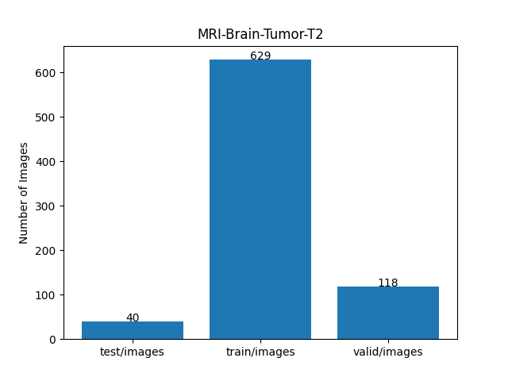 
 
On the derivation of the dataset, please refer to our repository: 
<a href="https://github.com/sarah-antillia/ImageMask-Dataset-Multiple-Sclerosis-Brain-MRI">
ImageMask-Dataset-Multiple-Sclerosis-Brain-MRI
</a>
  
As shown above, the number of images of train and valid datasets is not enough to use for a training set of our segmentation model.
 
 
<b>Train_images_sample</b> 
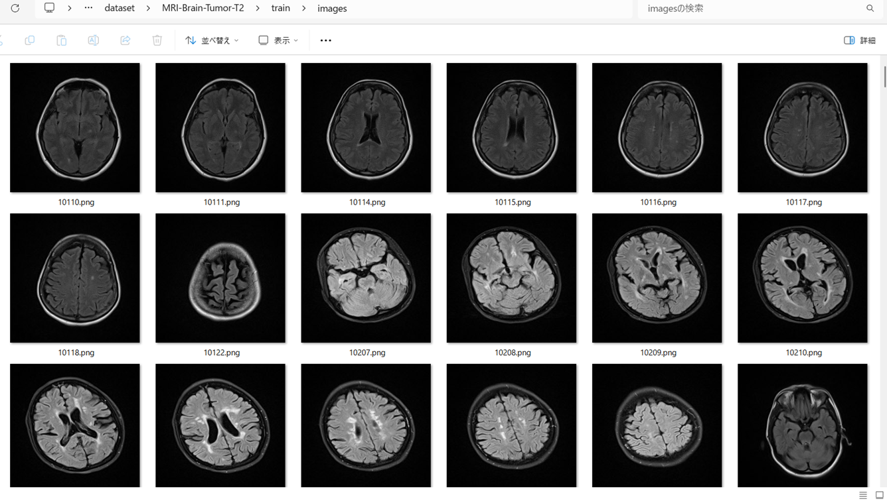
 
<b>Train_masks_sample</b> 
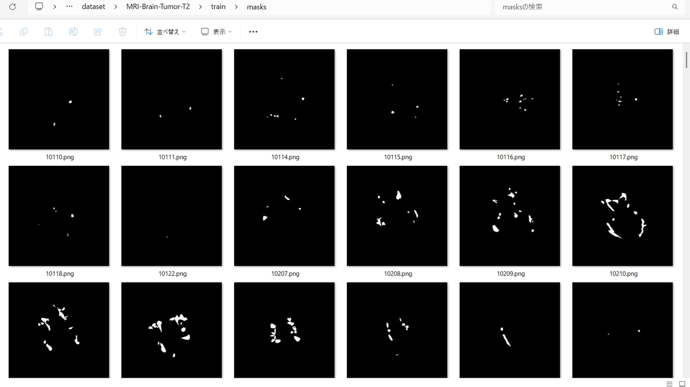
 
<h3>
3 Train TensorFlowFlexUNet Model
</h3>
 We trained MRI-Brain-Tumor-T2 TensorFlowFlexUNet Model by using the following
<a href="./projects/TensorFlowFlexUNet/MRI-Brain-Tumor-T2/train_eval_infer.config"> <b>train_eval_infer.config</b></a> file.  
Please move to ./projects/TensorFlowFlexUNet/MRI-Brain-Tumor-T2 and run the following bat file. 
<pre>
>1.train.bat
</pre>
, which simply runs the following command. 
<pre>
>python ../../../src/TensorFlowFlexUNetTrainer.py ./train_eval_infer.config
</pre>

<b>Model parameters</b> 
Defined a small <b>base_filters = 16 </b> and large <b>base_kernels = (9,9)</b> for the first Conv Layer of Encoder Block of 
<a href="./src/TensorFlowFlexUNet.py">TensorFlowFlexUNet.py</a> 
and a large num_layers (including a bridge between Encoder and Decoder Blocks).
<pre>
[model]
;You may specify your own UNet class derived from our TensorFlowFlexModel
model         = "TensorFlowFlexUNet"
generator     =  False
image_width    = 512
image_height   = 512
image_channels = 3
num_classes    = 2

base_filters   = 16
base_kernels   = (9,9)
num_layers     = 8
dropout_rate   = 0.04
dilation       = (1,1)
</pre>
<b>Learning rate</b> 
Defined a very small learning rate.  
<pre>
[model]
learning_rate  = 0.00005
</pre>
<b>Loss and metrics functions</b> 
Specified "categorical_crossentropy" and <a href="./src/dice_coef_multiclass.py">"dice_coef_multiclass"</a>. 
<pre>
[model]
loss           = "categorical_crossentropy"
metrics        = ["dice_coef_multiclass"]
</pre>
<b>Dataset class</b> 
Specifed <a href="./src/ImageCategorizedMaskDataset.py">ImageCategorizedMaskDataset</a> class. 
<pre>
[dataset]
class_name    = "ImageCategorizedMaskDataset"
</pre>
 
<b>Learning rate reducer callback</b> 
Enabled learing_rate_reducer callback, and a small reducer_patience.
<pre> 
[train]
learning_rate_reducer = True
reducer_factor     = 0.4
reducer_patience   = 4
</pre>
<b>Early stopping callback</b> 
Enabled early stopping callback with patience parameter.
<pre>
[train]
patience      = 10
</pre>

<b>RGB Color map</b> 
rgb color map dict for MRI-Brain-Tumor-T2 1+1 classes. 
<pre>
[mask]
mask_file_format = ".png"
; background:black  tumor: white
rgb_map = {(0,0,0):0, (255,255,255):1 }
</pre>

<b>Epoch change inference callback</b> 
Enabled <a href="./src/EpochChangeInfereuncer.py">epoch_change_infer callback</a></b>. 
<pre>
[train]
epoch_change_infer       = True
epoch_change_infer_dir   =  "./epoch_change_infer"
num_infer_images         = 6
</pre>

By using this callback, on every epoch_change, the inference procedure can be called
 for 6 images in <b>mini_test</b> folder. This will help you confirm how the predicted mask changes 
 at each epoch during your training process.    

<b>Epoch_change_inference output at starting (epoch 1,2,3)</b> 
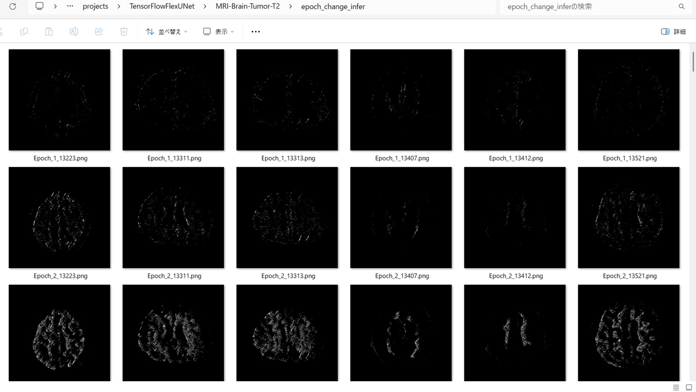 
 
<b>Epoch_change_inference output at middlepoint (epoch 21,22,23)</b> 
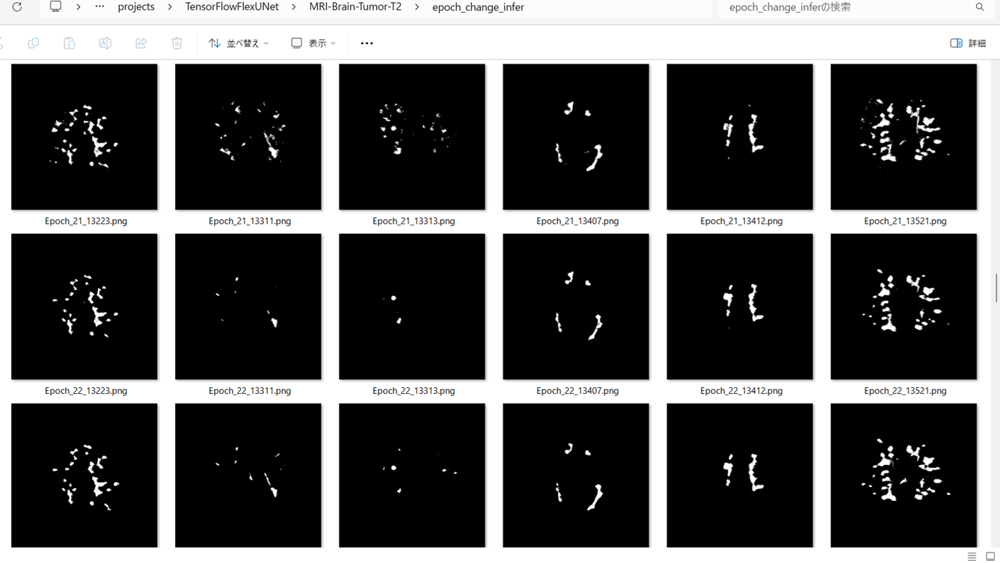 
 
<b>Epoch_change_inference output at ending (epoch 44,45,46)</b> 
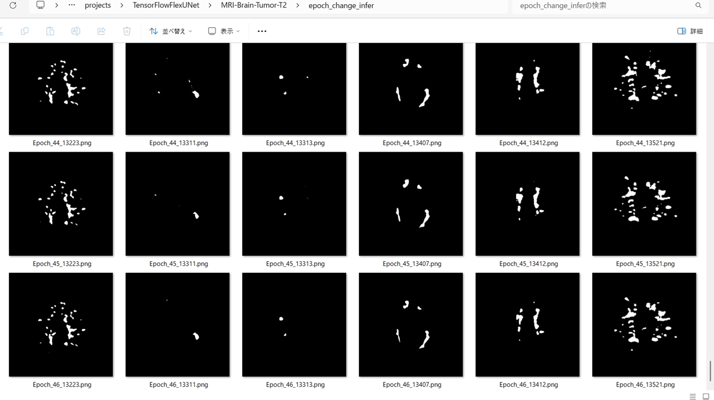 
 
In this experiment, the training process was stopped at epoch 46 by EarlyStopping callback.  
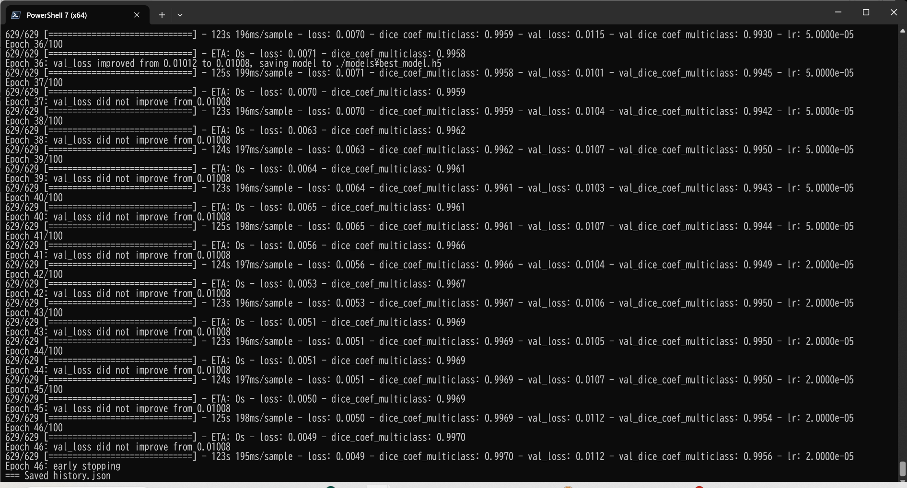 
 

<a href="./projects/TensorFlowFlexUNet/MRI-Brain-Tumor-T2/eval/train_metrics.csv">train_metrics.csv</a> 
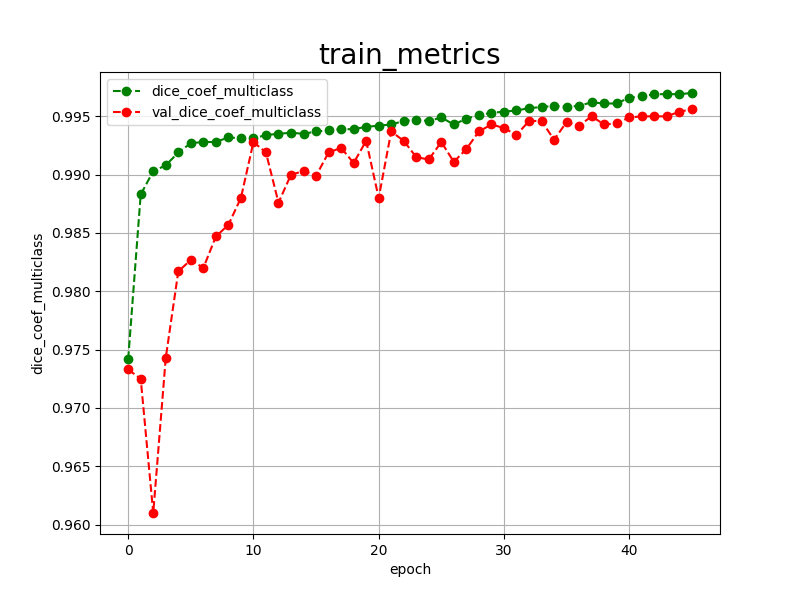 

 
<a href="./projects/TensorFlowFlexUNet/MRI-Brain-Tumor-T2/eval/train_losses.csv">train_losses.csv</a> 
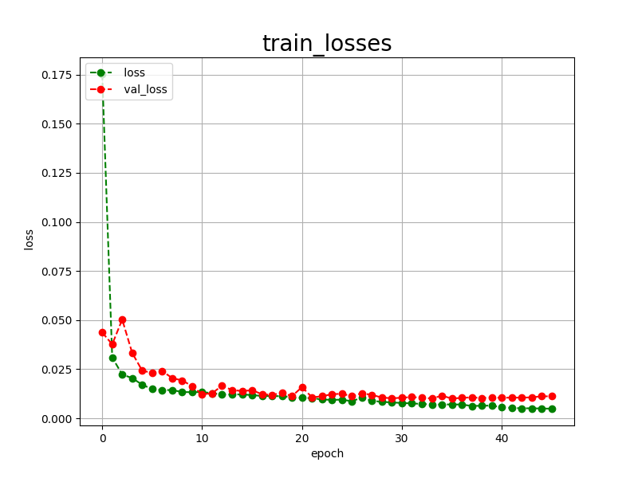 

 

<h3>
4 Evaluation
</h3>
Please move to <b>./projects/TensorFlowFlexUNet/MRI-Brain-Tumor-T2</b> folder, 
and run the following bat file to evaluate TensorFlowFlexUNet model for MRI-Brain-Tumor-T2. 
<pre>
./2.evaluate.bat
</pre>
This bat file simply runs the following command.
<pre>
python ../../../src/TensorFlowFlexUNetEvaluator.py ./train_eval_infer_aug.config
</pre>

Evaluation console output: 
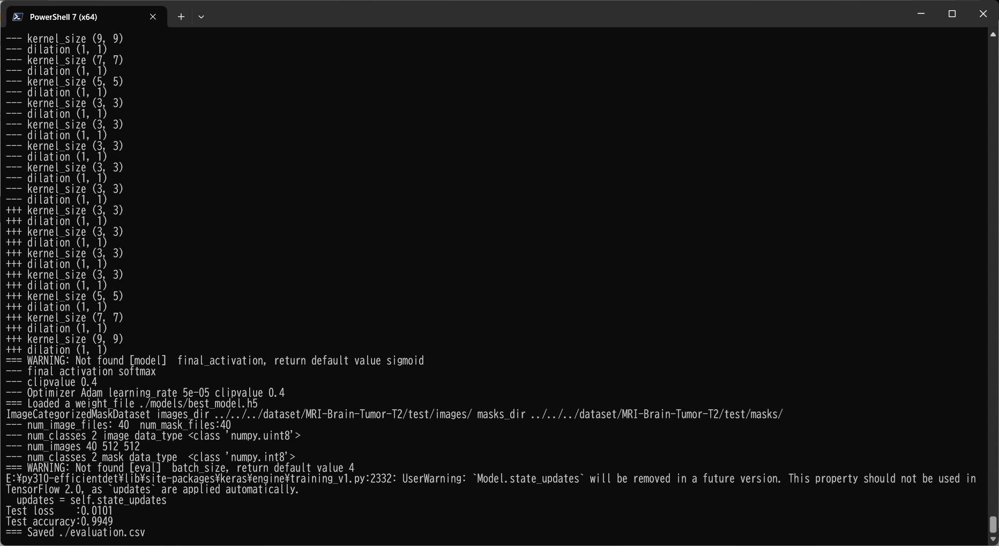
  

<a href="./projects/TensorFlowFlexUNet/MRI-Brain-Tumor-T2/evaluation.csv">evaluation.csv</a> 
The loss (categorical_crossentropy) to this MRI-Brain-Tumor-T2/test was very low and dice_coef_multiclass 
very high as shown below.
 
<pre>
categorical_crossentropy,0.0101
dice_coef_multiclass,0.9949
</pre>
 

<h3>
5 Inference
</h3>
Please move <b>./projects/TensorFlowFlexUNet/MRI-Brain-Tumor-T2</b> folder 
,and run the following bat file to infer segmentation regions for images by the Trained-TensorFlowFlexUNet model for MRI-Brain-Tumor-T2. 
<pre>
./3.infer.bat
</pre>
This simply runs the following command.
<pre>
python ../../../src/TensorFlowFlexUNetInferencer.py ./train_eval_infer_aug.config
</pre>

<b>mini_test_images</b> 
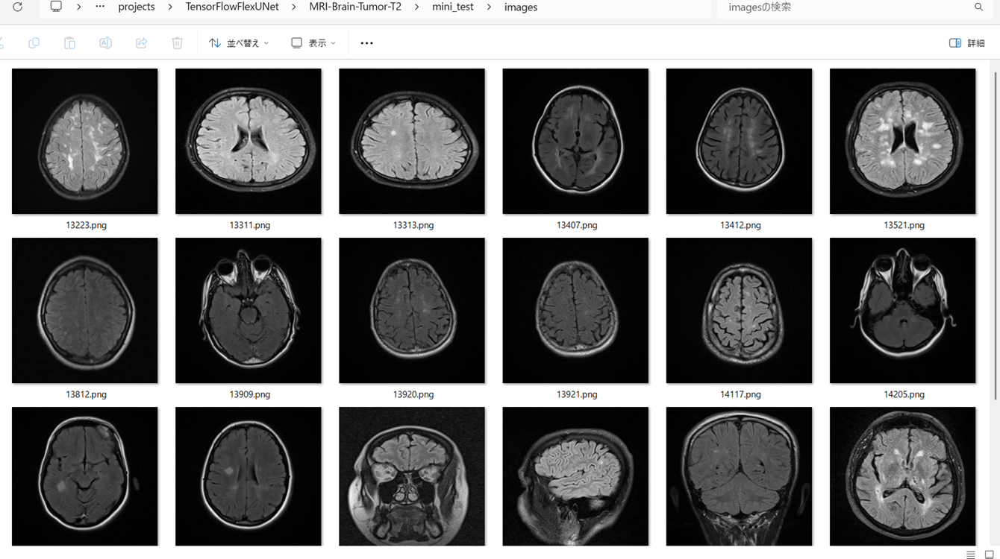 
<b>mini_test_mask(ground_truth)</b> 
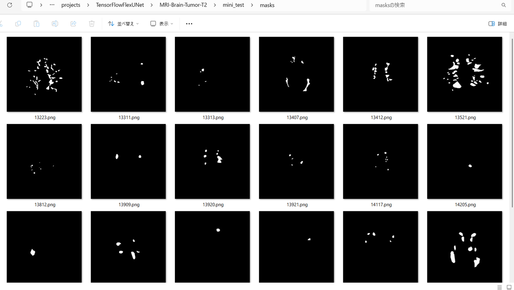 

<b>Inferred test masks</b> 
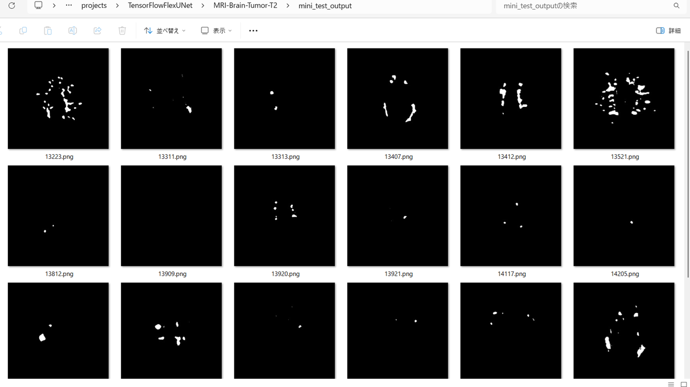 
 

<b>Enlarged images and masks of 512x512 pixels</b> 

<table>
<tr>
<th>Image</th>
<th>Mask (ground_truth)</th>
<th>Inferred-mask</th>
</tr>

<tr>
<td></td>
<td></td>
<td></td>
</tr>

<tr>
<td></td>
<td></td>
<td></td>
</tr>

<tr>
<td></td>
<td></td>
<td></td>
</tr>

<tr>
<td>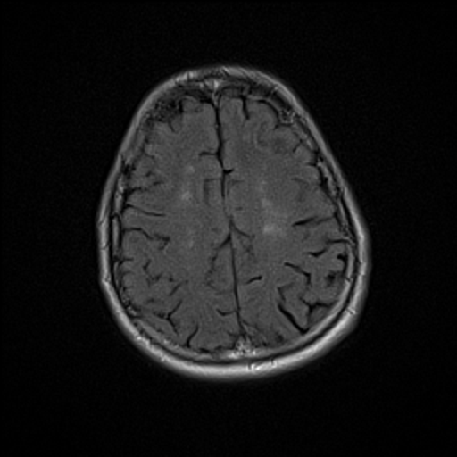</td>
<td></td>
<td></td>
</tr>

<tr>
<td>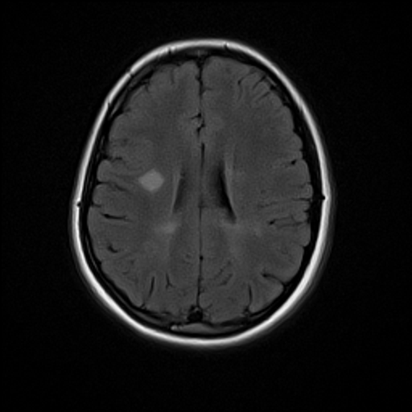</td>
<td></td>
<td></td>
</tr>

<tr>
<td>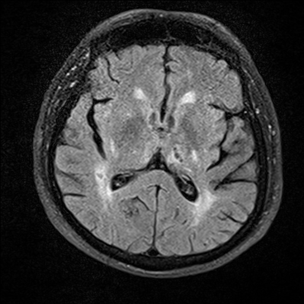</td>
<td></td>
<td>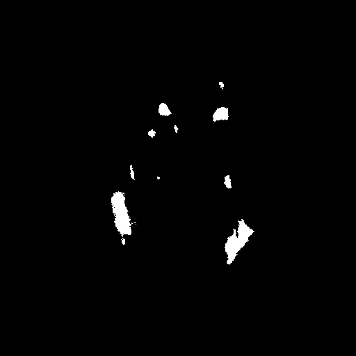</td>
</tr>
</table>

 
<h3>
References
</h3>
<b>1. Consensus of algorithms for lesion segmentation in brain MRI studies of multiple sclerosis </b> 
Alessandro Pasquale De Rosa, Marco Benedetto, Stefano Tagliaferri, Francesco Bardozzo, Alessandro D’Ambrosio,  
Alvino Bisecco, Antonio Gallo, Mario Cirillo, Roberto Tagliaferri & Fabrizio Esposito  

<a href="https://www.nature.com/articles/s41598-024-72649-9">https://www.nature.com/articles/s41598-024-72649-9</a>
 
 
<b>2. Tensorflow-Image-Segmentation-Multiple-Sclerosis-Brain-MRI-T1</b> 
Toshiyuki Arai @antillia.com 
<a href="https://github.com/sarah-antillia/Tensorflow-Image-Segmentation-Multiple-Sclerosis-Brain-MRI-T1">
https://github.com/sarah-antillia/Tensorflow-Image-Segmentation-Multiple-Sclerosis-Brain-MRI-T1
</a>
 
 
<b>3. Tensorflow-Image-Segmentation-Multiple-Sclerosis-Brain-MRI-Flair</b> 
Toshiyuki Arai @antillia.com 
<a href="https://github.com/sarah-antillia/Tensorflow-Image-Segmentation-Multiple-Sclerosis-Brain-MRI-Flair">
https://github.com/sarah-antillia/Tensorflow-Image-Segmentation-Multiple-Sclerosis-Brain-MRI-Flair
</a>
